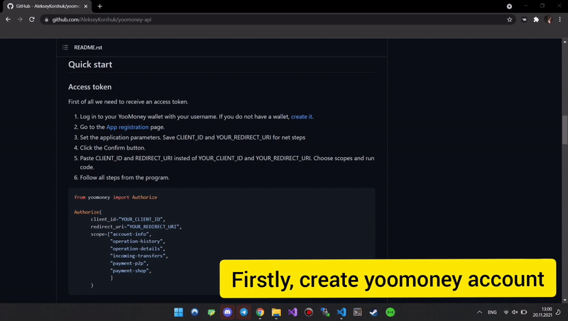

YooMoney API
============

*Unofficial Python library for the YooMoney API*

|pypi| |python| |license|

.. |pypi| image:: https://img.shields.io/pypi/v/yoomoney?color=blue&label=PyPI
   :target: https://pypi.org/project/yoomoney/
.. |python| image:: https://img.shields.io/pypi/pyversions/yoomoney
   :target: https://pypi.org/project/yoomoney/
.. |license| image:: https://img.shields.io/github/license/AlekseyKorshuk/yoomoney-api
   :target: https://github.com/AlekseyKorshuk/yoomoney-api/blob/master/LICENSE

`🇷🇺 Версия на русском языке <README_RU.rst>`_

----

.. contents:: Table of Contents
   :depth: 2
   :local:
   :backlinks: none

Introduction
============

This library provides a convenient Python wrapper around the
`YooMoney Wallet API <https://yoomoney.ru/docs/wallet>`__.
Both **synchronous** (``Client``) and **asynchronous** (``AsyncClient``) clients
are included out of the box.

Features
========

+-----------------------------+---------------------------------------------------------------+
| Method                      | Description                                                   |
+=============================+===============================================================+
| `Access token`_             | Obtain an OAuth access token.                                 |
+-----------------------------+---------------------------------------------------------------+
| `Account information`_      | Retrieve the current status of the user account.              |
+-----------------------------+---------------------------------------------------------------+
| `Operation history`_        | View the full or partial history of operations (paginated,    |
|                             | reverse-chronological order).                                 |
+-----------------------------+---------------------------------------------------------------+
| `Operation details`_        | Get detailed information about a single operation.            |
+-----------------------------+---------------------------------------------------------------+
| `Quickpay forms`_           | Generate a payment form that can be embedded into any website |
|                             | or blog.                                                      |
+-----------------------------+---------------------------------------------------------------+

Installation
============

**From PyPI** (recommended):

.. code-block:: shell

   pip install yoomoney --upgrade

Or with `uv <https://docs.astral.sh/uv/>`_:

.. code-block:: shell

   uv add yoomoney

**From source**:

.. code-block:: shell

   git clone https://github.com/AlekseyKorshuk/yoomoney-api --recursive
   cd yoomoney-api
   uv sync

Quick start
===========

Access token
------------

First of all you need to receive an access token.

1. Log in to your YooMoney wallet. If you do not have one,
   `create it <https://yoomoney.ru/reg>`_.
2. Go to the `App registration <https://yoomoney.ru/myservices/new>`_ page.
3. Set the application parameters. Save **CLIENT_ID** and **REDIRECT_URI** for
   the next steps.
4. Click **Confirm**.
5. Replace the placeholders below with your real credentials, choose the
   required scopes, and run the code.
6. Follow the on-screen instructions.

.. code-block:: python

   from yoomoney import Authorize

   Authorize(
       client_id="YOUR_CLIENT_ID",
       redirect_uri="YOUR_REDIRECT_URI",
       client_secret="YOUR_CLIENT_SECRET",
       scope=[
           "account-info",
           "operation-history",
           "operation-details",
           "incoming-transfers",
           "payment-p2p",
           "payment-shop",
       ],
   )

You are done with the most difficult part!

Account information
-------------------

Replace ``YOUR_TOKEN`` and run:

.. code-block:: python

   from yoomoney import Client

   client = Client("YOUR_TOKEN")
   user = client.account_info()

   print("Account number:", user.account)
   print("Account balance:", user.balance)
   print("Currency (ISO 4217):", user.currency)
   print("Account status:", user.account_status)
   print("Account type:", user.account_type)

   print("Extended balance information:")
   for key, value in vars(user.balance_details).items():
       print(f"  {key}: {value}")

   print("Linked bank cards:")
   if user.cards_linked:
       for card in user.cards_linked:
           print(f"  {card.pan_fragment} — {card.type}")
   else:
       print("  No cards linked")

.. code-block:: text

   Account number: 410019014512803
   Account balance: 999999999999.99
   Currency (ISO 4217): 643
   Account status: identified
   Account type: personal
   Extended balance information:
     total: 999999999999.99
     available: 999999999999.99
     deposition_pending: None
     blocked: None
     debt: None
     hold: None
   Linked bank cards:
     No cards linked

Operation history
-----------------

Replace ``YOUR_TOKEN`` and run:

.. code-block:: python

   from yoomoney import Client

   client = Client("YOUR_TOKEN")
   history = client.operation_history()

   print("List of operations:")
   print("Next page starts with:", history.next_record)

   for op in history.operations:
       print()
       print(f"Operation: {op.operation_id}")
       print(f"  Status     : {op.status}")
       print(f"  Datetime   : {op.datetime}")
       print(f"  Title      : {op.title}")
       print(f"  Pattern id : {op.pattern_id}")
       print(f"  Direction  : {op.direction}")
       print(f"  Amount     : {op.amount}")
       print(f"  Label      : {op.label}")
       print(f"  Type       : {op.type}")

.. code-block:: text

   List of operations:
   Next page starts with: None

   Operation: 670278348725002105
     Status     : success
     Datetime   : 2021-10-10 10:10:10
     Title      : Пополнение с карты ****4487
     Pattern id : None
     Direction  : in
     Amount     : 100500.0
     Label      : 3784030974
     Type       : deposition

   Operation: 670244335488002313
     Status     : success
     Datetime   : 2021-10-10 10:10:10
     Title      : Перевод от 410019014512803
     Pattern id : p2p
     Direction  : in
     Amount     : 100500.0
     Label      : 7920963969
     Type       : incoming-transfer

Operation details
-----------------

Replace ``YOUR_TOKEN`` and ``OPERATION_ID`` (e.g. ``670244335488002312``) and run:

.. code-block:: python

   from yoomoney import Client

   client = Client("YOUR_TOKEN")
   details = client.operation_details(operation_id="OPERATION_ID")

   for key, value in vars(details).items():
       if not key.startswith("_"):
           print(f"{key:20s} : {str(value).replace(chr(10), ' ')}")

.. code-block:: text

   operation_id         : 670244335488002312
   status               : success
   pattern_id           : p2p
   direction            : in
   amount               : 100500.0
   amount_due           : None
   fee                  : None
   datetime             : 2021-10-10 10:10:10
   title                : Перевод от 410019014512803
   sender               : 410019014512803
   recipient            : None
   recipient_type       : None
   message              : Justtext
   comment              : None
   codepro              : False
   protection_code      : None
   expires              : None
   answer_datetime      : None
   label                : 7920963969
   details              : Justtext
   type                 : incoming-transfer
   digital_goods        : None

Quickpay forms
--------------

.. code-block:: python

   from yoomoney import Quickpay

   quickpay = Quickpay(
       receiver="410019014512803",
       quickpay_form="shop",
       targets="Sponsor this project",
       paymentType="SB",
       sum=150,
   )

   print(quickpay.base_url)
   print(quickpay.redirected_url)

.. code-block:: text

   https://yoomoney.ru/quickpay/confirm.xml?receiver=410019014512803&quickpay-form=shop&targets=Sponsor%20this%20project&paymentType=SB&sum=150
   https://yoomoney.ru/transfer/quickpay?requestId=343532353937313933395f66326561316639656131626539326632616434376662373665613831373636393537613336383639

Async client
============

An asynchronous client (``AsyncClient``) exposes the same API as the synchronous
``Client``, but every method is a coroutine. Use it as an ``async with`` context
manager so the underlying connection pool is closed properly.

Async account information
-------------------------

.. code-block:: python

   import asyncio
   from yoomoney import AsyncClient

   async def main():
       async with AsyncClient("YOUR_TOKEN") as client:
           user = await client.account_info()

           print("Account number:", user.account)
           print("Account balance:", user.balance)
           print("Currency (ISO 4217):", user.currency)
           print("Account status:", user.account_status)
           print("Account type:", user.account_type)

           print("Extended balance information:")
           for key, value in vars(user.balance_details).items():
               print(f"  {key}: {value}")

           print("Linked bank cards:")
           if user.cards_linked:
               for card in user.cards_linked:
                   print(f"  {card.pan_fragment} — {card.type}")
           else:
               print("  No cards linked")

   asyncio.run(main())

Async operation history
-----------------------

.. code-block:: python

   import asyncio
   from yoomoney import AsyncClient

   async def main():
       async with AsyncClient("YOUR_TOKEN") as client:
           history = await client.operation_history()

           print("List of operations:")
           print("Next page starts with:", history.next_record)

           for op in history.operations:
               print()
               print(f"Operation: {op.operation_id}")
               print(f"  Status     : {op.status}")
               print(f"  Datetime   : {op.datetime}")
               print(f"  Title      : {op.title}")
               print(f"  Pattern id : {op.pattern_id}")
               print(f"  Direction  : {op.direction}")
               print(f"  Amount     : {op.amount}")
               print(f"  Label      : {op.label}")
               print(f"  Type       : {op.type}")

   asyncio.run(main())

Async operation details
-----------------------

.. code-block:: python

   import asyncio
   from yoomoney import AsyncClient

   async def main():
       async with AsyncClient("YOUR_TOKEN") as client:
           details = await client.operation_details(operation_id="OPERATION_ID")

           for key, value in vars(details).items():
               if not key.startswith("_"):
                   print(f"{key:20s} : {str(value).replace(chr(10), ' ')}")

   asyncio.run(main())

----

License
=======

This project is licensed under the
`GPL-3.0 <https://github.com/AlekseyKorshuk/yoomoney-api/blob/master/LICENSE>`_.
